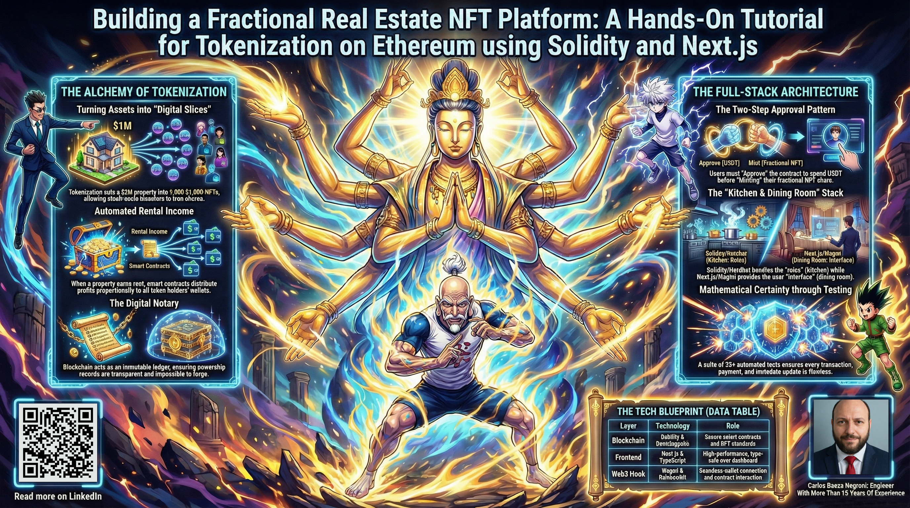
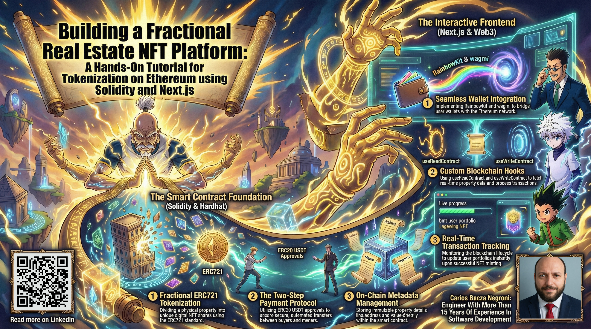
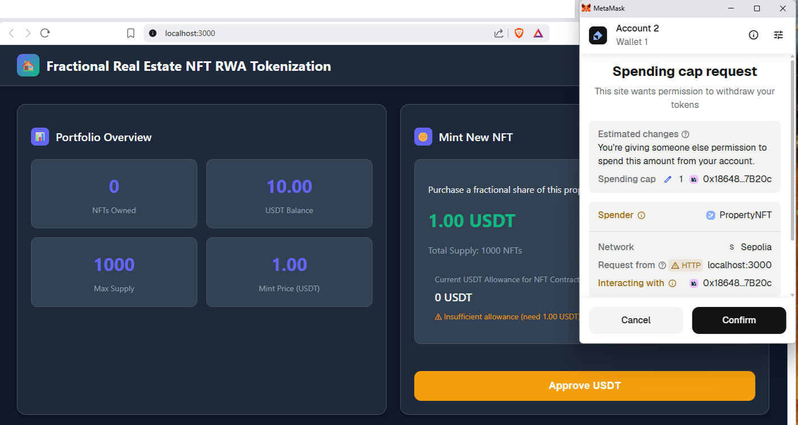
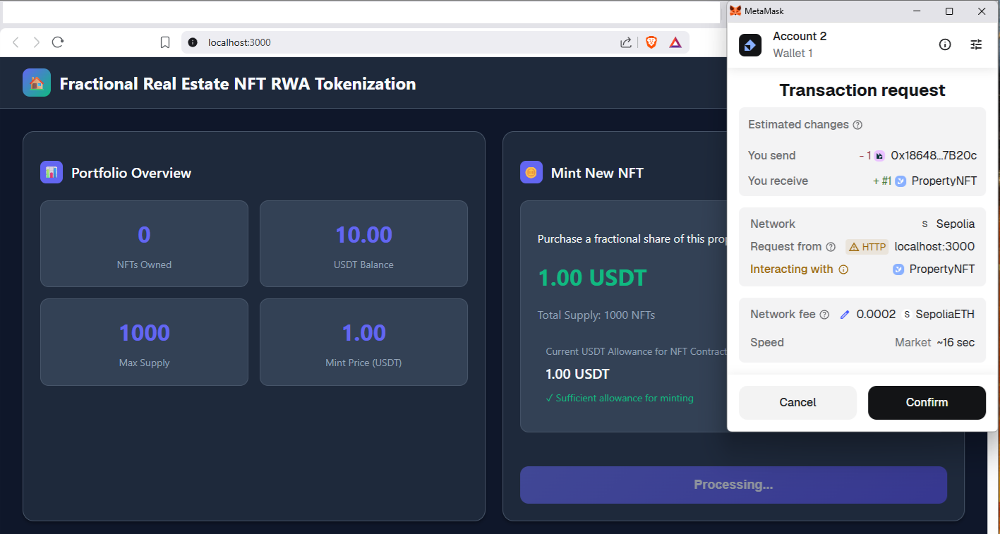
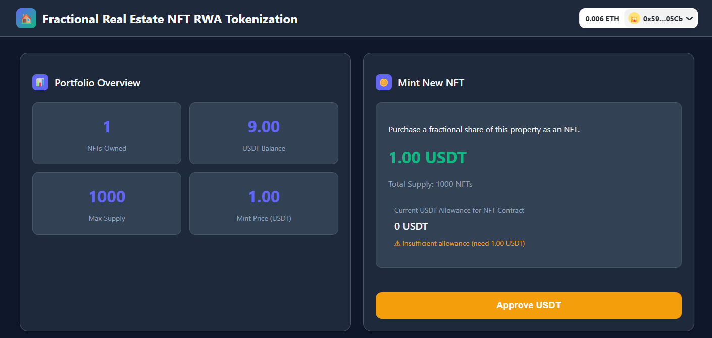
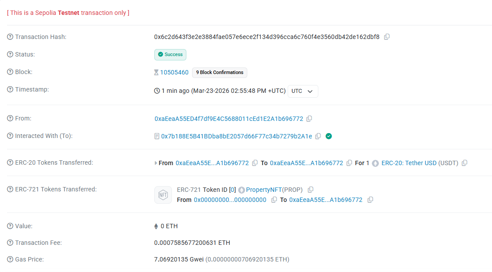

# Building a Fractional Real Estate NFT Platform: A Hands-On Tutorial for Tokenization on Ethereum using Solidity and Next.js


- Project Repository: https://github.com/cjbaezilla/Tokenize-Fractional-Real-Estate-NFT-Solidity-HandsOn-Tutorial

## Introduction: The Future of Property Investment

Imagine a world where you could own a piece of a luxury apartment building without needing to save hundreds of thousands of dollars. Picture being able to buy and sell your share of real estate as easily as trading digital collectibles. This vision is becoming reality through the powerful combination of blockchain technology and non-fungible tokens. In this comprehensive tutorial, we will explore how to build a complete decentralized application that tokenizes real estate into fractional ownership shares.

The project you are about to study represents a full-stack blockchain application that demonstrates Real World Asset tokenization at its core. This is not merely a theoretical concept but a working system that combines smart contracts with modern web technology to create something previously impossible: democratized access to real estate investment through digital tokens.

## What is Tokenization? (For Absolute Beginners)

Imagine a luxury apartment building costs $1,000,000. Only millionaires could buy it outright. But what if we could cut that building into 1,000 digital pieces, each worth $1,000? Now ordinary people can own a small share. This is called **tokenization** - turning a physical asset into digital tokens that represent ownership.

**Fractional ownership** means you don't own the whole building; you own a small slice. If the building earns rental income or increases in value, your slice grows too. It's like owning shares in a company, but for real estate.

**Blockchain** is just a secure, public digital ledger that records who owns which token. Think of it as a worldwide spreadsheet that everyone can see but no one can cheat on.

**NFTs (Non-Fungible Tokens)** are unique digital certificates. Each one proves you own a specific share of the property.

**Smart contracts** are automated programs that enforce the rules - like a vending machine that automatically gives you a token when you pay.

No technical knowledge needed to follow along - we'll explain everything as we go!

## Real-World Use Cases (Why This Matters)

Tokenization isn't just a cool tech demo - it's transforming how people invest. Here are concrete applications:

### 1. **Luxury Real Estate**
A $5 million penthouse in Manhattan is cut into 5,000 tokens at $1,000 each. Maria, a teacher, buys 10 tokens for $10,000. When the building generates $500,000 in annual rent, each token holder receives $100. Five years later, the property sells for $7 million. Maria's 10 tokens now worth $14,000 - she made $4,000 profit without ever buying the whole building.

### 2. **Commercial Properties**
A shopping mall in Dubai tokenizes its ownership. Local residents who believe in the area's growth can invest small amounts. This democratizes commercial real estate investment that was previously only for wealthy institutions.

### 3. **Vacation Homes & Timeshares**
Instead of buying a timeshare for specific weeks, you own tokens representing fractional ownership. You can sell your tokens anytime on a secondary market - no locked-in contracts.

### 4. **Rental Income Distribution**
An apartment complex generates $100,000 monthly rent. With 1,000 tokens, each token earns $100 monthly. Token holders receive automated distributions directly to their wallets - no waiting for checks or dealing with property managers.

### 5. **Art & Collectibles**
A Picasso painting worth $50 million is tokenized into 50,000 shares at $1,000 each. Art enthusiasts worldwide can own a piece of the masterpiece and trade their shares without transferring the actual painting.

### 6. **Music Royalties**
A popular song generates $1 million/year in streaming royalties. The rights are tokenized into 100,000 shares. Token holders receive proportional payments monthly. Fans can invest in their favorite artists' success.

### 7. **Commodities & precious metals**
A gold bar worth $60,000 is tokenized into 60,000 tokens. Each token represents 1 gram of gold. You can buy, sell, or trade digital gold instantly without storage hassles.

### 8. **Carbon Credits**
Environmental projects generate carbon credits. Tokenizing them makes them accessible to smaller companies wanting to offset emissions, creating a liquid market for sustainability.



## Simple Analogy Recap
- **Tokenization** = Cutting a pizza into slices so everyone can afford a piece
- **Fractional Ownership** = Owning a percentage of something rather than the whole
- **Blockchain** = A worldwide digital notary that never makes mistakes
- **NFT** = Your digital title deed that can't be forged
- **Smart Contract** = An automatic robot that follows rules exactly
- **Gas Fee** = Small postage fee paid to the blockchain network
- **Testnet** = Practice mode with fake money (like Monopoly)
- **Wallet** = Digital safe that holds your tokens and proves you are you

## The Concept of Fractional Ownership

Traditional real estate investment has always carried significant barriers to entry. The requirement for substantial capital, the complexity of legal agreements, and the illiquid nature of property have kept many potential investors on the sidelines. Fractional ownership attempts to solve these problems by dividing a single property into multiple digital shares, each represented as a unique token on the blockchain.

Each token represents a fractional stake in the underlying asset. When the property generates rental income or appreciates in value, the benefits flow proportionally to all token holders. This model mirrors real estate investment trusts but with the added benefits of blockchain: transparency, immediate settlement, and global accessibility.

Our tutorial implements a specific variant where a single property is represented as an NFT collection. The property itself is described through immutable metadata stored on-chain, while each minted token serves as proof of fractional ownership. The economic model is straightforward: participants pay a fixed price in USDT, a stablecoin pegged to the US dollar, to receive a token representing their share.

## Breaking Down the Technology Stack

Before diving into the code, let us understand the technologies that make this possible. The system consists of two major components that work in harmony: the blockchain layer built with Solidity and Hardhat, and the frontend application built with Next.js and modern Web3 libraries.

### Real-World Analogy: Building a Restaurant

Think of building this system like opening a restaurant:

- **Blockchain layer** = The kitchen where food is actually prepared (the core operations)
- **Smart contracts** = The recipes and cooking rules that chefs must follow exactly
- **Solidity** = The language the chefs write their recipes in
- **Ethereum** = The health inspector and record-keeper that verifies everything
- **Hardhat** = The practice kitchen where chefs train before cooking for real customers
- **Frontend application** = The dining room where customers sit and order food
- **Next.js** = The blueprints and construction materials for building the dining room
- **Web3 libraries** = The waiters who translate customer orders to the kitchen and bring back food
- **Wallet** = Your ID and payment method combined into one secure card

### Detailed Technology Breakdown

The blockchain layer runs on Ethereum or compatible networks. Smart contracts written in Solidity define the rules for ownership, payment processing, and metadata management. These contracts are deployed to the blockchain where they execute autonomously without any central authority. OpenZeppelin provides battle-tested implementations of standard token contracts that we build upon, ensuring security and compliance with established specifications.

The frontend layer provides the user interface that makes the system accessible. Built with Next.js, it offers server-side rendering, excellent performance, and a great developer experience. Web3 integration happens through wagmi and RainbowKit, which handle wallet connections, blockchain interactions, and state management. viem serves as the low-level Ethereum library that actually communicates with the blockchain network.



## The Smart Contract: Heart of the System

**Simple Explanation:** A smart contract is a digital agreement that lives on the blockchain and automatically enforces the rules. In this case, it's like a robot property manager that handles: (1) creating digital shares, (2) collecting payments, and (3) recording who owns what. No humans needed - the code runs itself.

**Analogy:** Think of the smart contract like an automatic vending machine for property shares. You insert USDT (money), press a button (call purchase), and out comes a token (your share). The machine checks everything automatically: enough money? Yes. Shares available? Yes. It never makes a mistake, never sleeps, and can't be bribed.

Let's walk through what happens when someone buys a share using real numbers:

### Concrete Example: Buying a Share

Imagine:
- Property value: $500,000
- Total tokens: 1,000
- Price per token: $500 (in USDT)
- You buy 2 tokens = $1,000

**What happens step-by-step:**

1. You connect your wallet to the website
2. You click "Approve USDT" → This gives the contract permission to take $1,000 from your wallet (like signing a check)
3. You click "Mint NFT" → Contract immediately:
   - Takes $1,000 USDT from your wallet
   - Creates 2 digital tokens (#100 and #101)
   - Gives those tokens to your wallet
   - Records the transaction permanently on blockchain
4. You now own 0.2% of the property (2 out of 1,000 shares)

**Why This Is Revolutionary:**
- Traditional real estate: Need $50,000 minimum, lawyers, paperwork, weeks of waiting
- Tokenized real estate: Need $500, no lawyers, 2-minute transaction, global access

### Rental Income Example

If this $500,000 property earns $30,000 rent per year:
- Total annual distribution: $30,000 ÷ 1,000 tokens = $30 per token
- You have 2 tokens → You earn $60/year automatically (no chasing the property manager)
- The contract distributes this directly to your wallet

Let us examine the main smart contract in detail. The BaseErc721PropertyNFT contract is an ERC721 implementation specifically designed for real estate tokenization. Its structure reveals several important patterns that are worth understanding thoroughly.

### Contract Structure and Inheritance

**What this section means:** The contract inherits capabilities from two parent contracts:
- **ERC721** gives it NFT functionality (creating unique tokens)
- **Ownable** gives it owner-only controls (like admin privileges)

The variables track everything: current token ID, maximum supply, price, accepted payment token, and all the property details.

### Simple Explanation of Core Ideas:
- **Token ID**: Each share gets a unique number (0, 1, 2, etc.)
- **Max Supply**: The total number of shares that will ever exist
- **Mint Price**: How much one share costs
- **USDT Token**: The stablecoin used for payment (1 USDT ≈ $1)

```solidity
contract BaseErc721PropertyNFT is ERC721, Ownable {
    uint256 private _nextTokenId;
    uint256 public immutable maxSupply;
    uint256 public mintPrice; 
    IERC20 public usdtToken;
    
    string private _propertyAddress;
    uint256 private _propertyValue;
    string private _propertyType;
    uint256 private _propertyRooms;
    uint256 private _propertyBaths;
    string private _description;
    string private _imageData;
    string private _externalUrl;

    event Purchased(address indexed buyer, uint256 tokenId, uint256 price);
```

The contract inherits from ERC721, which provides the standard NFT functionality, and Ownable, which gives us access control capabilities through the onlyOwner modifier. The inheritance syntax in Solidity allows a contract to inherit multiple base contracts, combining their functionality. The order of inheritance matters for linearization, but in this case both parent contracts are independent.

The state variables store all the information needed to operate the system. The `_nextTokenId` counter tracks which token IDs have been used. Because we start at zero and increment sequentially, we automatically enforce that tokens are unique and ordered by creation time. The `maxSupply` parameter is marked as immutable, meaning it can only be set in the constructor and never changed afterward. This provides gas savings compared to regular storage variables and adds guarantees about the total supply cap.

The `mintPrice` variable holds the cost to purchase a token in wei units. Remember that USDT uses 6 decimals instead of the 18 decimals used by ETH, so this price must be handled carefully when converting between human-readable amounts and internal representation. The `usdtToken` variable stores the address of the ERC20 token that will be used for payments.

Property metadata occupies eight separate variables. This design choice makes updating individual fields straightforward, though it does consume more gas than a packed structure might. The metadata is global rather than per-token, meaning all tokens in this collection share the same property description. This reflects the business model where one property generates multiple fractional ownership tokens.

The Purchased event logs successful transactions. Events in Solidity serve as indexed logs that applications can efficiently filter and retrieve. The indexed `buyer` parameter allows quick lookups of all tokens purchased by a given address, while the tokenId and price provide additional context.

### Constructor: Initializing the Contract

```solidity
constructor(
    address initialOwner,
    string memory name,
    string memory ticker,
    uint256 _maxSupply,
    uint256 _mintPrice,
    address _usdtToken
)
    ERC721(name, ticker)
    Ownable(initialOwner)
{
    maxSupply = _maxSupply;
    mintPrice = _mintPrice;
    usdtToken = IERC20(_usdtToken);
}
```

The constructor runs exactly once when the contract is deployed. It receives several parameters that configure the contract for a specific property. The name and ticker become the NFT collection name and symbol, appearing in wallets and marketplaces. The maximum supply sets an absolute upper bound on how many tokens can ever exist. The mint price determines the cost of each fractional share. The USDT token address specifies which ERC20 token to accept for payment.

Notice how the constructor calls the parent constructors using the unusual syntax where they appear after the constructor declaration but before the opening brace. This is how Solidity handles constructor chaining in multiple inheritance scenarios. The Ownable constructor receives the initial owner address, establishing who has administrative privileges.

### The Minting Functions

Two separate functions exist for creating new tokens, each serving a different purpose and accessible to different callers.

```solidity
function safeMint(address to) public onlyOwner returns (uint256) {
    require(_nextTokenId < maxSupply, "Max supply exceeded");
    uint256 tokenId = _nextTokenId++;
    _safeMint(to, tokenId);
    return tokenId;
}
```

The safeMint function allows the contract owner to create tokens at will. This serves several purposes: initial distribution, promotional giveaways, or creating tokens for later sale through secondary markets. The onlyOwner modifier restricts this powerful function to the designated administrator. The require statement checks whether we have reached the maximum supply limit, reverting the transaction if tokens are no longer available. The `_safeMint` function actually creates the token and assigns it to the recipient address. Using safeMint rather than the simpler _mint provides an additional safety check: if the recipient is a smart contract, it will be queried to ensure it can handle ERC721 tokens properly, preventing accidental loss of tokens to contracts that do not implement the receiver interface.

```solidity
function purchase() public returns (uint256) {
    require(_nextTokenId < maxSupply, "Max supply exceeded");
    
    // Transfer USDT from buyer to owner
    bool transferred = usdtToken.transferFrom(msg.sender, owner(), mintPrice);
    require(transferred, "USDT transfer failed");
    
    uint256 tokenId = _nextTokenId++;
    _safeMint(msg.sender, tokenId);
    
    emit Purchased(msg.sender, tokenId, mintPrice);
    
    return tokenId;
}
```

The purchase function implements the public buying mechanism. Anyone can call this function to buy a token directly. The first requirement checks supply limits as before. Then comes the critical payment step: we call `transferFrom` on the USDT token contract. This ERC20 standard function moves tokens from the caller to the specified recipient. However, this only works if the caller has first approved the NFT contract to spend their tokens. We will examine this two-step approval pattern in more detail later.

The transferFrom function returns a boolean indicating success. The require statement checks this return value; if the transfer failed for any reason (insufficient balance, insufficient allowance, or contract failure), the entire transaction reverts. This pattern follows the Checks-Effects-Interactions principle where we validate conditions before making state changes or external calls. In this function we actually perform the external call before minting, but because USDT is a well-audited standard token and we are only transferring a fixed price, the risk is minimal. More complex contracts might implement reentrancy guards or use the Checks-Effects-Interactions ordering more strictly.

After the payment succeeds, we increment the token ID and mint the token to the purchaser. The Purchased event logs the transaction details for off-chain indexing. Finally, the tokenId is returned to the caller, which can be useful for immediate UI updates without requiring another blockchain query.

### Metadata Management

The contract provides extensive metadata management capabilities through multiple update functions. The batch update function allows changing all property details at once:

```solidity
function updatePropertyMetadata(
    string memory propertyAddress,
    uint256 propertyValue,
    string memory propertyType,
    uint256 propertyRooms,
    uint256 propertyBaths,
    string memory description,
    string memory imageData,
    string memory externalUrl
) public onlyOwner {
    _propertyAddress = propertyAddress;
    _propertyValue = propertyValue;
    _propertyType = propertyType;
    _propertyRooms = propertyRooms;
    _propertyBaths = propertyBaths;
    _description = description;
    _imageData = imageData;
    _externalUrl = externalUrl;
}
```

Individual update functions for each field provide granular control. All these functions are restricted to the contract owner, ensuring that only authorized personnel can modify the property representation. The separation between global property metadata and individual token ownership is an important design choice. All tokens in the collection refer to the same underlying property, so the metadata describing that property is naturally shared. If you wanted each token to represent different properties, you would need to redesign this architecture.

### Token URI and NFT Standards

The tokenURI function generates the metadata that NFT marketplaces and wallets will display. It must return a JSON string conforming to the ERC721 metadata standard, optionally extended with OpenSea attributes:

```solidity
function tokenURI(uint256 tokenId) public view override returns (string memory) {
    require(tokenId < _nextTokenId, "Token does not exist");
    
    string memory json = string(abi.encodePacked(
        '{"name": "Property #', 
        Strings.toString(tokenId), 
        '", "description": "', 
        _description, 
        '", "image": "', 
        _imageData, 
        '", "external_url": "',
        _externalUrl,
        '", "attributes": [',
        '{"trait_type": "Type", "value": "', _propertyType, '"},',
        '{"trait_type": "Value", "value": ', Strings.toString(_propertyValue), '},',
        '{"trait_type": "Address", "value": "', _propertyAddress, '"},',
        '{"trait_type": "Rooms", "value": ', Strings.toString(_propertyRooms), '},',
        '{"trait_type": "Bathrooms", "value": ', Strings.toString(_propertyBaths), '}',
        ']}'
    ));
    
    return json;
}
```

This implementation constructs the JSON directly on-chain using string concatenation. The `abi.encodePacked` function packs multiple strings and values together efficiently, though care must be taken with special characters that could break JSON structure. The `Strings.toString` helper converts numeric values to their string representation. Notice that numeric attributes like property value, rooms, and bathrooms are emitted as numbers in the JSON (without quotes around them) rather than strings, which is correct for NFT attribute standards.

The function first checks that the requested token exists by comparing the tokenId against `_nextTokenId`. Since we only increment token IDs when minting and never reuse them, any tokenId less than the current `_nextTokenId` exists, while any greater or equal does not.

### Getters for Read Access

Numerous getter functions provide read access to contract state:

```solidity
function getPropertyAddress() public view returns (string memory) {
    return _propertyAddress;
}

function getPropertyValue() public view returns (uint256) {
    return _propertyValue;
}

// ... and similar for other fields

function mintPrice() public view returns (uint256) {
    return mintPrice;
}
```

Some variables like `maxSupply` and `mintPrice` are already public, which automatically generates getter functions with matching names. For private state variables, we need to explicitly define view functions to expose their values. This gives us control over naming and allows us to add additional logic later if needed.

## The Mock USDT Token: Testing Payments

**Simple Explanation:** In testing, we don't want to use real money. So we create a "fake USDT" that acts exactly like the real stablecoin but with unlimited supply. This lets us experiment without spending actual dollars. Think of it like using play money in a board game.

The second contract, MockUSDT, serves as a test double for the real USDT token. It implements the ERC20 standard with the correct 6-decimal precision that actual USDT uses.

```solidity
contract MockUSDT is ERC20, Ownable {
    uint8 private constant DECIMALS = 6;

    constructor(address initialOwner) ERC20("Tether USD", "USDT") Ownable(initialOwner) {
        _mint(initialOwner, 1000000 * 10 ** DECIMALS); // 1M USDT
    }

    function decimals() public view virtual override returns (uint8) {
        return DECIMALS;
    }

    function mint(address to, uint256 amount) public onlyOwner {
        _mint(to, amount);
    }
}
```

This mock token demonstrates several important patterns. The `decimals` function overrides the default 18 decimals from ERC20 to return 6, which matches the real USDT implementation. The constructor mints an initial supply of one million tokens to the deployer, giving us plenty of test currency. The additional `mint` function allows the owner to create more tokens as needed during testing, which is invaluable for simulating various user scenarios.

In a production deployment, you would use the actual USDT token address on your chosen network. For testing and educational purposes, the mock provides full control and eliminates dependencies on external systems.

## Testing Strategy: Ensuring Correct Behavior

**Analogy: Why We Test**
Smart contracts are like permanent tattoos - once deployed, you can't change them. A bug could mean losing thousands of dollars. Testing is like practicing the tattoo design 35 times on paper first. The test suite here has 35 different test cases that simulate every possible scenario, so when real money flows, we're confident the system works perfectly.

Imagine building a bridge. You wouldn't open it to cars without testing every bolt, right? Smart contracts hold people's money - they need the same rigor. Our tests check:
- ✅ Can only the owner create tokens? (admin security)
- ✅ Does the contract reject payments that are too small? (business logic)
- ✅ What happens if someone tries to buy after all tokens sold? (edge cases)
- ✅ Does the USDT actually transfer correctly? (money movement)
- ✅ Can a user with 0 tokens not purchase? (access control)

### Concreate Test Example

Here's a real test from our suite showing what we verify:

```javascript
it("Should allow anyone to purchase a token with correct USDT payment", async function () {
    // Setup: User has 1000 USDT, token costs 500 USDT
    await usdt.connect(nonOwner).approve(
        await baseErc721PropertyNFT.getAddress(),
        1000 * 10 ** 6  // 1000 USDT in wei
    );

    // Action: User buys one token
    const tx = await baseErc721PropertyNFT.connect(nonOwner).purchase();
    await tx.wait();

    // Verify: User now owns token #0
    expect(await baseErc721PropertyNFT.ownerOf(0)).to.equal(nonOwner.address);

    // Verify: User's USDT decreased by exactly 500
    const balanceAfter = await usdt.balanceOf(nonOwner.address);
    expect(balanceAfter).to.equal(500 * 10 ** 6); // 500 USDT remaining

    // Verify: Owner received 500 USDT
    const ownerBalanceAfter = await usdt.balanceOf(owner.address);
    expect(ownerBalanceAfter).to.equal(initialOwnerBalance + 500 * 10 ** 6);

    // Verify: Total supply increased to 1
    expect(await baseErc721PropertyNFT.totalSupply()).to.equal(1);

    // Verify: Event was emitted with correct data
    await expect(tx).to.emit(baseErc721PropertyNFT, "Purchased")
        .withArgs(nonOwner.address, 0, 500 * 10 ** 6);
});
```

This single test verifies 5 things simultaneously. Our 35 tests cover all permutations - different users, different order of operations, failure cases, and edge conditions. When all tests pass, we have mathematical certainty the contract behaves as designed.

```javascript
describe("BaseErc721PropertyNFT", function () {
  let BaseErc721PropertyNFT;
  let MockUSDT;
  let baseErc721PropertyNFT;
  let usdt;
  let owner;
  let nonOwner;
  let anotherUser;

  const NAME = "TestPropertyNFT";
  const SYMBOL = "TPNFT";
  const MAX_SUPPLY = 100;
  const MINT_PRICE_USDT = ethers.parseUnits("100", 6); // 100 USDT (6 decimals)
```

The test setup follows the Arrange-Act-Assert pattern consistently. Before each test group, the `beforeEach` hook deploys fresh contract instances, ensuring test isolation. The `ethers.parseUnits("100", 6)` call shows the correct way to handle token decimals: convert human-readable amounts to the smallest unit by specifying the token's decimal places. Hardhat's ethers.js integration provides this utility.

The deployment of the NFT contract passes the USDT token address as a constructor argument, establishing the dependency between the two contracts. Tests then proceed to verify each aspect of system behavior:

### Deployment Tests

These verify that the constructor correctly initializes all parameters:

```javascript
it("Should set the correct name and symbol", async function () {
    expect(await baseErc721PropertyNFT.name()).to.equal(NAME);
    expect(await baseErc721PropertyNFT.symbol()).to.equal(SYMBOL);
});

it("Should set the correct max supply", async function () {
    expect(await baseErc721PropertyNFT.maxSupply()).to.equal(MAX_SUPPLY);
});
```

### Owner Minting Tests

These validate the safeMint function's behavior, including access control, token ID sequencing, and supply limits:

```javascript
it("Should mint a token to the owner (onlyOwner)", async function () {
    await expect(baseErc721PropertyNFT.connect(nonOwner).safeMint(nonOwner.address))
        .to.be.reverted; // Only owner can mint

    const tx = await baseErc721PropertyNFT.safeMint(nonOwner.address);
    await tx.wait();

    expect(await baseErc721PropertyNFT.ownerOf(0)).to.equal(nonOwner.address);
    expect(await baseErc721PropertyNFT.balanceOf(nonOwner.address)).to.equal(1);
});
```

The test first checks that a non-owner cannot mint (expecting a revert), then actually performs a mint and verifies that token ID zero is assigned to the recipient. Testing both success and failure paths is crucial.

### Purchase Tests

The most extensive category covers the public purchase flow. These tests examine the complete interaction where a user with USDT tokens buys an NFT:

```javascript
it("Should allow anyone to purchase a token with correct USDT payment", async function () {
    const purchasePrice = await baseErc721PropertyNFT.mintPrice();

    await expect(baseErc721PropertyNFT.connect(nonOwner).purchase())
        .to.emit(baseErc721PropertyNFT, "Purchased")
        .withArgs(nonOwner.address, 0, purchasePrice)
        .and.to.emit(baseErc721PropertyNFT, "Transfer")
        .withArgs(ethers.ZeroAddress, nonOwner.address, 0);

    expect(await baseErc721PropertyNFT.ownerOf(0)).to.equal(nonOwner.address);
    expect(await baseErc721PropertyNFT.balanceOf(nonOwner.address)).to.equal(1);
});
```

This test simultaneously verifies the Purchased event emissions and checks that the standard Transfer event also occurs. ERC721 expects Transfer events for all ownership changes, including minting from the zero address. The chain of assertions proves that payment processing, token creation, and event emission all happen correctly.

The tests also cover failure scenarios:

```javascript
it("Should reject if insufficient USDT allowance", async function () {
    // Revoke allowance
    await usdt.connect(nonOwner).approve(
        await baseErc721PropertyNFT.getAddress(),
        0
    );

    await expect(
        baseErc721PropertyNFT.connect(nonOwner).purchase()
    ).to.be.revertedWithCustomError(usdt, "ERC20InsufficientAllowance");
});
```

This test reveals the two-step approval pattern's importance. The user must first call approve on the USDT token, granting the NFT contract permission to spend their tokens. Without this, transferFrom fails with a specific error.

The balance change test proves that money actually moves:

```javascript
it("Should transfer USDT from buyer to owner upon purchase", async function () {
    const purchasePrice = await baseErc721PropertyNFT.mintPrice();
    const ownerUSDTBefore = await usdt.balanceOf(owner.address);
    const buyerUSDTBefore = await usdt.balanceOf(nonOwner.address);

    await baseErc721PropertyNFT.connect(nonOwner).purchase();

    const ownerUSDTAfter = await usdt.balanceOf(owner.address);
    const buyerUSDTAfter = await usdt.balanceOf(nonOwner.address);

    expect(ownerUSDTAfter - ownerUSDTBefore).to.equal(purchasePrice);
    expect(buyerUSDTBefore - buyerUSDTAfter).to.equal(purchasePrice);
});
```

### Metadata Tests

These verify that property information can be set and retrieved correctly:

```javascript
it("Should update all property metadata (onlyOwner)", async function () {
    await expect(
        baseErc721PropertyNFT.connect(nonOwner).updatePropertyMetadata(...)
    ).to.be.reverted;

    const tx = await baseErc721PropertyNFT.updatePropertyMetadata(...);
    await tx.wait();

    expect(await baseErc721PropertyNFT.getPropertyAddress()).to.equal(PROPERTY_ADDRESS);
    expect(await baseErc721PropertyNFT.getPropertyValue()).to.equal(PROPERTY_VALUE);
    // ... more assertions
});
```

The tests check access control first, then verify each getter returns the updated values. Individual update functions receive similar treatment.

### Token URI Tests

These ensure that the JSON metadata format matches what NFT platforms expect:

```javascript
it("Should return correct JSON format with updated metadata", async function () {
    await baseErc721PropertyNFT.safeMint(nonOwner.address);
    await baseErc721PropertyNFT.updatePropertyMetadata(...);

    const tokenURI = await baseErc721PropertyNFT.tokenURI(0);
    const parsed = JSON.parse(tokenURI);

    expect(parsed.name).to.equal("Property #0");
    expect(parsed.description).to.equal(DESCRIPTION);
    expect(parsed.attributes).to.be.an("array").with.lengthOf(5);

    expect(parsed.attributes[0]).to.deep.equal({
        trait_type: "Type",
        value: PROPERTY_TYPE
    });
    // ... more attribute checks
});
```

Parsing the returned JSON and asserting on its structure proves that the on-chain string construction produces valid, well-formed metadata.

### Edge Cases

The final category tests behaviors that might not be obvious:

```javascript
it("Should maintain metadata separately from token existence", async function () {
    await baseErc721PropertyNFT.updatePropertyMetadata("Address 1", ...);
    await baseErc721PropertyNFT.safeMint(nonOwner.address);
    let tokenURI = await baseErc721PropertyNFT.tokenURI(0);
    expect(tokenURI).to.include("Address 1");

    // Update metadata after minting
    await baseErc721PropertyNFT.updatePropertyMetadata("Address 2", ...);

    // New token should have new metadata (since it's global)
    await baseErc721PropertyNFT.safeMint(anotherUser.address);
    tokenURI = await baseErc721PropertyNFT.tokenURI(1);
    expect(tokenURI).to.include("Address 2");
});
```

This test confirms that property metadata is indeed global: changing it affects all subsequently minted tokens but does not retroactively change already-minted tokens. This behavior matches the intended design where the property description might evolve over time.

## The Frontend Application: Making Blockchain Accessible

**Simple Explanation:** Most people don't want to type commands or understand code. They want a website with buttons and clear information. This frontend translates the complex blockchain into a simple dashboard: it shows your balance, lets you click "Approve" and "Buy", and displays your property details in plain English. It's the friendly face of the technology.

**Analogy:** The frontend is like an ATM for property tokens. When you use an ATM, you don't need to know how banks communicate or how money moves between vaults. You just insert your card, enter your PIN, see your balance, and press buttons. Similarly, this website connects your crypto wallet, shows your USDT and NFT balances, and lets you buy property shares with clicks. All the complex blockchain stuff happens behind the scenes.

### What the User Sees (A Concrete Walkthrough)

Let's follow Maria, a teacher who wants to invest $1,000:

1. **Landing Page** → Sees property details: "Luxury Apartment at 123 Main St" with photo, value $500,000, 1-bed/1-bath
2. **Connect Wallet** → Clicks "Connect Wallet" → MetaMask pops up → She clicks "Connect"
3. **Dashboard Updates** → Now sees:
   - "Your NFT Balance: 0"
   - "Your USDT Balance: $2,500.00"
   - "Property Price: $500 per token"
   - "Remaining Shares: 847 out of 1,000"
4. **Approval Step** → Sees "You need to approve USDT spending" → Clicks "Approve USDT" → Wallet shows confirmation → She confirms (pays small gas fee ~$0.50)
5. **Buying** → After 15 seconds, button changes to "Mint NFT Now" → Clicks it → Wallet shows "Confirm purchase ($1,000)" → She confirms
6. **Success** → Dashboard now shows "Your NFT Balance: 2" → She owns 0.2% of the apartment!
7. **Portfolio** → She can see her total investment value, recent transactions, and rental income projections

### The React Architecture (How It's Built)

The Next.js application brings the smart contract to life with a user-friendly interface. Let us examine its architecture and key patterns.

### Project Structure

The frontend follows Next.js Pages Router conventions with TypeScript for type safety. The most important files include:

- `pages/index.tsx`: Main dashboard component (499 lines)
- `hooks/usePropertyNft.ts`: Custom hook for NFT contract interactions (139 lines)
- `hooks/useMockUsdt.ts`: Custom hook for USDT token interactions (98 lines)
- `contracts/propertyNFT.ts` and `contracts/mockUSDT.ts`: Type-safe contract wrappers
- `styles/Home.module.css`: Scoped styling with CSS modules

### Web3 Configuration

The wagmi configuration in `wagmi.ts` sets up the blockchain connection:

```typescript
import { getDefaultConfig } from '@rainbow-me/rainbowkit';
import { sepolia } from 'wagmi/chains';

export const config = getDefaultConfig({
    appName: 'RainbowKit App',
    projectId: 'YOUR_PROJECT_ID',
    chains: [sepolia],
    ssr: true,
});
```

The configuration specifies that we will interact with the Sepolia testnet, an Ethereum network used for testing with free fake ETH. The `ssr: true` setting enables server-side rendering compatibility, which is important for Next.js applications that might render on the server. The projectId comes from WalletConnect Cloud and enables mobile wallet connections.

The React provider structure in `_app.tsx` wraps the entire application:

```typescript
import { QueryClient, QueryClientProvider } from '@tanstack/react-query';
import { WagmiProvider } from 'wagmi';
import { RainbowKitProvider } from '@rainbow-me/rainbowkit';

const client = new QueryClient();

function MyApp({ Component, pageProps }: AppProps) {
    return (
        <WagmiProvider config={config}>
            <QueryClientProvider client={client}>
                <RainbowKitProvider>
                    <Component {...pageProps} />
                </RainbowKitProvider>
            </QueryClientProvider>
        </WagmiProvider>
    );
}
```

The nesting order matters: Wagmi must be outermost because it provides context that RainbowKit relies on. TanStack Query manages data fetching and caching separately. This architecture separates concerns while allowing all components to access the necessary context.

### Custom Hook Pattern

The `usePropertyNft` hook demonstrates an excellent pattern for blockchain interactions:

```typescript
export const usePropertyNft = () => {
    const { writeContract, data: hash, error, isPending } = useWriteContract();
    const { isLoading: isWaitingForTransaction, isSuccess } = useWaitForTransactionReceipt({ hash });

    // Read hooks for all contract getters
    const name = useReadContract({ address, abi, functionName: 'name' });
    const maxSupply = useReadContract({ address, abi, functionName: 'maxSupply' });
    const propertyAddress = useReadContract({ address, abi, functionName: 'getPropertyAddress' });
    // ... more read hooks

    return {
        name: name.data as string | undefined,
        maxSupply: maxSupply.data as bigint | undefined,
        // ... mapped data with type assertions
        purchase: () => writeContract({ address, abi, functionName: 'purchase' }),
        // ... other actions
    };
};
```

This pattern consolidates all contract interactions into a single reusable hook. The `useReadContract` hook automatically handles caching, loading states, and error management for view functions. The `useWriteContract` hook manages transaction submission, while `useWaitForTransactionReceipt` polls for confirmation. Type assertions (`as string | undefined`) bridge the gap between wagmi's generic return types and our specific contract interface.

The hook returns both the data and the status flags, allowing the UI to react appropriately to loading states, errors, and success conditions.

### Main Dashboard Layout

The `index.tsx` component renders a comprehensive dashboard organized into logical sections:

1. **Header**: Contains the application title and the RainbowKit ConnectButton for wallet connection.
2. **Portfolio Overview**: Displays the connected user's NFT count, USDT balance, total supply, and mint price in a grid of statistics.
3. **Minting Interface**: Shows purchase information and provides buttons for approval and minting.
4. **Property Details**: Presents the property metadata including image, address, value, rooms, bathrooms, and description.
5. **Contract Information**: Shows deployment addresses and token details.
6. **Recent Transactions**: Lists the last five user transactions with timestamps.

The component heavily uses conditional rendering based on `isConnected` to show different content before and after wallet connection. The approval and minting logic implements a state machine:

```typescript
const isAllowanceSufficient = allowance && mintPrice && usdtDecimals
    ? Number(allowance) >= Number(mintPrice)
    : false;
```

When allowance is insufficient, the interface shows an "Approve USDT" button that triggers the token approval transaction. After approval succeeds, the allowance increases and the interface automatically switches to show the "Mint NFT Now" button. This two-step flow is necessary because ERC20 tokens require prior authorization before a contract can spend them.

### Transaction Handling

The component maintains a `transactions` state array that tracks recent activity:

```typescript
const [transactions, setTransactions] = useState<Array<{type: string; hash: string; time: Date}>>([]);
```

Effects monitor the success states from both purchase and approval operations:

```typescript
useEffect(() => {
    if (isSuccess && hash) {
        setTransactions(prev => [{
            type: 'Mint NFT',
            hash,
            time: new Date()
        }, ...prev].slice(0, 5));
        
        queryClient.invalidateQueries({
            predicate: (query) => {
                const [key, params] = query.queryKey as [string, any];
                return (
                    key === 'readContract' &&
                    params?.address?.toLowerCase() === MOCK_USDT_ADDRESS?.toLowerCase() &&
                    params?.functionName === 'balanceOf'
                );
            }
        });
    }
}, [isSuccess, hash, queryClient]);
```

This pattern accomplishes two purposes: it displays recent transactions to the user, and it invalidates cached USDT balance data so the UI refreshes to show the new balance after a purchase. The query invalidation uses a predicate function to selectively target only balance queries for the USDT token, leaving other cached data untouched.

### Number Formatting

The component includes utility functions to convert token amounts from their raw wei representation to human-readable USDT amounts:

```typescript
const formatUSDT = (value: bigint | undefined, decimals: bigint | undefined) => {
    if (!value || !decimals) return '0';
    const formattedValue = (Number(value) / Math.pow(10, Number(decimals))).toFixed(2);
    const numberValue = parseFloat(formattedValue);
    return numberValue.toLocaleString('en-US', {
        minimumFractionDigits: 2,
        maximumFractionDigits: 2,
    });
};
```

This conversion handles the division by 10^decimals to convert from the smallest token unit to the display unit, then formats with exactly two decimal places and comma separators for thousands.

## Running the Project: Step-by-Step Guide

**Analogy: What We're Doing**
This section is the setup manual. We'll install software, deploy the smart contract to a test blockchain (like a practice real estate market with fake money), start the website, and walk through buying your first share. Think of it as assembling furniture - follow the steps and you'll have a working system.

**The Big Picture:**
1. Install tools (like getting your toolbox ready)
2. Practice on testnet (like a practice driving course)
3. Deploy your contract (like registering your property with the county)
4. Start the website (like opening your real estate office)
5. Make a test purchase (like buying your first share as practice)

### Prerequisites Installation

First, ensure Node.js version 18 or later is installed. You can verify by running:

```bash
node --version
```

If the output shows a version earlier than 18, visit nodejs.org to download the latest LTS version. Node.js includes npm, the package manager we will use to install dependencies.

**Analogy:** Node.js is like the engine in a car - everything runs on it. npm is the gas station where you get all the parts you need.

### Smart Contract Setup

Navigate to the `hardhat2` directory and install the required packages:

```bash
cd hardhat2
npm install
```

This reads the `package.json` file and downloads all dependencies into a `node_modules` folder. The project relies on Hardhat for compilation and testing, OpenZeppelin for secure contract templates, and various Hardhat plugins for verification, coverage, and gas reporting.

**What's Happening:** Think of `npm install` like downloading all the books you need from a library. The package.json is your reading list - npm fetches everything automatically.

Create an environment configuration file by copying the example:

```bash
cp .env.example .env
```

Then edit the `.env` file to add your Sepolia RPC endpoint and private key. You can obtain a free RPC URL from services like Alchemy or Infura by creating a project and selecting the Sepolia network. Your private key should come from a cryptocurrency wallet like MetaMask. **Important**: Use a wallet that contains only test ETH on Sepolia, never a wallet with real funds. You can get free test ETH from a faucet such as sepoliafaucet.com.

**Analogy:** 
- RPC URL = Your phone number to call the blockchain
- Private Key = Your password to access your wallet
- Test ETH = Play money for a practice game

The `.env` file should look like:

```
SEPOLIA_RPC_URL=https://eth-sepolia.g.alchemy.com/v2/your-api-key
PRIVATE_KEY=abc123def456... (your 64-character hex string without 0x prefix)
ETHERSCAN_API_KEY=YourEtherscanAPIKey
```

Compile the contracts to check for syntax errors and generate the artifact files:

```bash
npx hardhat compile
```

You should see output showing compilation of both contracts. The compiled bytecode and ABI (Application Binary Interface) are saved in the `artifacts` directory. These artifacts are essential for both testing and frontend integration.

**Analogy:** Compiling is like translating a recipe from English into a language the chef (blockchain) can understand. The artifacts are the final instruction booklet.

### Running Tests

Execute the comprehensive test suite:

```bash
npx hardhat test
```

Watch as the terminal displays each test's progress. You should see 35 tests passing. The tests cover every important function and edge case in the contract. If any test fails, the output will indicate which assertion failed and why. This immediate feedback is invaluable during development.

For a coverage report showing what percentage of your contract code is exercised by tests:

```bash
npx hardhat coverage
```

The coverage report generates an HTML file you can open in a browser, highlighting which lines are covered by tests and which remain untested.

**Analogy:** Tests are like a checklist before flying a plane. Coverage shows how much of the plane you've checked - 100% means every bolt and wire has been verified.

### Local Deployment

Start a local Ethereum node for development:

```bash
npx hardhat node
```

This command starts a local blockchain that mimics Ethereum but uses fake accounts with unlimited test ETH. The node runs on http://127.0.0.1:8545 and will display the accounts and their private keys in the terminal. Keep this process running in one terminal window.

In another terminal, deploy the contracts to your local network:

```bash
cd hardhat2
npx hardhat ignition:deploy ./ignition/modules/BaseErc721PropertyNFT.ts --network localhost
```

Hardhat Ignition provides a declarative deployment system that tracks deployed contracts and their relationships. The deployment will output the contract addresses. Make note of these addresses, as you will need them for frontend configuration.

The deployment also records the addresses in `ignition/deployments/chain-31337/deployed_addresses.json` for reproducibility.

### Frontend Setup

Switch to the `nextjs` directory and install dependencies:

```bash
cd ../nextjs
npm install
```

Create a `.env.local` file from the example:

```bash
cp .env.example .env.local
```

Edit `.env.local` to include your deployed contract addresses:

```
NEXT_PUBLIC_PROPERTY_NFT_ADDRESS=0x5FbDB2315678afecb367f032d93F642f64180aa3
NEXT_PUBLIC_MOCK_USDT_ADDRESS=0xe7f1725E7734CE288F8367e1Bb143E90bb3F0512
```

These are example addresses from the localhost deployment; use the actual addresses from your deployment output.

You also need a WalletConnect Project ID to enable wallet connections. Register for free at walletconnect.com/cloud and create a new project. Then add this to your `.env.local`:

```
NEXT_PUBLIC_WALLETCONNECT_PROJECT_ID=your-project-id-here
```

Update the `wagmi.ts` file to use this environment variable for the projectId setting.

#### Understanding TypeChain for Type Safety

Your frontend TypeScript code interacts with the deployed smart contracts through their Application Binary Interfaces, or ABIs. The ABI defines the functions, parameters, and return types that your application can call. Without type safety, developers must manually write these interfaces as JavaScript objects, risking mismatched parameter names, incorrect types, or missing functions that cause runtime errors when transactions fail.

TypeChain automates this process by generating TypeScript type definitions directly from your Solidity contracts. When you run ```npx hardhat compile```, the TypeChain plugin reads the compiled artifacts, extracts the ABI and function signatures, and produces strongly-typed contract classes in the typechain-types directory. These generated classes provide compile-time checking: if you attempt to call a function that does not exist or pass a string where a number is expected, TypeScript flags the error before the code ever reaches the browser.

The hardhat.config.js file includes TypeChain configuration pointing to the typechain-types output directory and targeting ethers-v6, which matches the ethers version used in your frontend. After compilation, you can import your contracts like any TypeScript module:

```typescript
import { BaseErc721PropertyNFT } from "../typechain-types";
import { MockUSDT } from "../typechain-types";
```

The generated BaseErc721PropertyNFT class includes all contract functions as methods with correctly typed parameters and return values. For instance, the purchase function appears as:

```typescript
purchase(): Promise<ContractTransaction>;
```

TypeScript knows this function takes no arguments and returns a Promise of ContractTransaction, preventing accidental parameter passing. Similarly, read functions like tokenURI have matching signatures:

```typescript
tokenURI(tokenId: BigNumberish): Promise<string>;
```

The tokenId parameter requires a BigNumberish type (bigint, number, or string representation), and the function returns a Promise resolving to the metadata JSON string. This eliminates entire classes of bugs where developers might pass the wrong data type or forget to await a promise.

Whenever you modify your Solidity contracts, you must recompile to update the TypeChain types. The compilation process overwrites the typechain-types directory with fresh definitions matching your current contract code. Your frontend imports automatically reference the updated types on the next build. This tight coupling between contract changes and frontend type safety ensures your entire application remains consistent as the smart contract evolves.

TypeChain also generates contract factories for deployment, though your project uses Hardhat Ignition for deployment scripts. The factories remain useful for testing and potential programmatic deployments outside Ignition. The combination of TypeScript and TypeChain creates a type-safe full-stack development experience rarely seen in blockchain applications, significantly reducing development friction and runtime failures.

### Hardhat Configuration with TypeChain

The current `hardhat.config.js` uses `@nomicfoundation/hardhat-toolbox`, which includes TypeChain with default settings. However, to generate types compatible with ethers.js v6 (required by wagmi/viem), you must add explicit TypeChain configuration. The article mentions this but the actual config file lacks it.

Update your `hardhat.config.js` to include the TypeChain plugin and configuration:

```javascript
require("dotenv").config();
require("@nomicfoundation/hardhat-toolbox");
require("@typechain/hardhat");

/** @type import('hardhat/config').HardhatUserConfig */
module.exports = {
  solidity: {
    version: "0.8.28",
    settings: {
      optimizer: {
        enabled: true,
        runs: 200,
      },
      viaIR: true,
      evmVersion: "cancun",
    },
  },
  typechain: {
    outDir: "typechain-types",
    target: "ethers-v6",
    alwaysGenerateOverloads: true,
    discardExternalAndInternalErrors: true,
  },
  networks: {
    localhost: {
      url: "http://127.0.0.1:8545",
    },
    sepolia: {
      url: process.env.SEPOLIA_RPC_URL || "",
      accounts: process.env.PRIVATE_KEY ? [process.env.PRIVATE_KEY] : [],
    },
  },
  etherscan: {
    apiKey: process.env.ETHERSCAN_API_KEY,
  },
};
```

**TypeChain Configuration Options**

| Option | Default | Recommended | Purpose |
|--------|---------|-------------|---------|
| `outDir` | `typechain-types` | `typechain-types` | Output directory for generated TypeScript types |
| `target` | N/A (required) | `ethers-v6` | Generates types compatible with ethers.js v6 |
| `alwaysGenerateOverloads` | `false` | `true` | Creates function overloads for better type inference |
| `discardExternalAndInternalErrors` | `false` | `true` | Simplifies error types in TypeScript |

After updating the config, regenerate types:

```bash
cd hardhat2
npx hardhat compile
```

Check that `typechain-types/` contains `BaseErc721PropertyNFT.ts` and `MockUSDT.ts` with properly typed method signatures.

### Deployment Scripts with Hardhat Ignition

The article references Hardhat Ignition but doesn't show the actual deployment modules. Hardhat Ignition provides a declarative deployment system that tracks deployed contracts and their relationships. The project includes two modules:

#### BaseErc721PropertyNFT Module

File: `hardhat2/ignition/modules/BaseErc721PropertyNFT.ts`

```typescript
import { buildModule } from "@nomicfoundation/hardhat-ignition/modules";

const BaseErc721PropertyNFTModule = buildModule("BaseErc721PropertyNFTModule", (m) => {
  // Deployment parameters with defaults
  const initialOwner = m.getParameter("initialOwner", "0xaEeaA55ED4f7df9E4C5688011cEd1E2A1b696772");
  const name = m.getParameter("name", "Luxury 3-Bedroom Apartment: 123 Main St, City, Country");
  const ticker = m.getParameter("ticker", "123-Main-St-City-Country");
  const maxSupply = m.getParameter("maxSupply", 1000n);
  const mintPrice = m.getParameter("mintPrice", 1000000n); // 1 USDT (6 decimals)
  const usdtToken = m.getParameter("usdtToken", "0x18648D890d389438a12962965E5c47d9C667B20c");

  // Property metadata parameters
  const propertyAddress = m.getParameter("propertyAddress", "123 Main St, City, Country");
  const propertyValue = m.getParameter("propertyValue", 500000n);
  const propertyType = m.getParameter("propertyType", "Apartment");
  const propertyRooms = m.getParameter("propertyRooms", 3n);
  const propertyBaths = m.getParameter("propertyBaths", 2n);
  const description = m.getParameter("description", "This premium fractionalized apartment represents a smart real estate investment opportunity. Own a share of this beautifully renovated 3-bedroom, 2-bathroom apartment in the heart of downtown. The property features modern finishes, floor-to-ceiling windows, and premium amenities including a rooftop pool and 24/7 concierge.");
  const imageData = m.getParameter("imageData", "https://ipfs.io/ipfs/bafybeiceq4fw66eswi34axd6423kqawmurkwjg7haotwmar7r4luzobeem");
  const externalUrl = m.getParameter("externalUrl", "https://baeza.me");

  // Deploy the contract
  const baseErc721PropertyNFT = m.contract("BaseErc721PropertyNFT", [
    initialOwner,
    name,
    ticker,
    maxSupply,
    mintPrice,
    usdtToken
  ]);

  // Update property metadata after deployment
  m.call(baseErc721PropertyNFT, "updatePropertyMetadata", [
    propertyAddress,
    propertyValue,
    propertyType,
    propertyRooms,
    propertyBaths,
    description,
    imageData,
    externalUrl
  ]);

  return { baseErc721PropertyNFT };
});

export default BaseErc721PropertyNFTModule;
```

**Architecture Patterns**

| Pattern | Code | Why |
|---------|------|-----|
| Parameterization | `m.getParameter("maxSupply", 1000n)` | Enables customization per deployment |
| Constructor separation | Core args in `m.contract()`, metadata in `m.call()` | Keeps immutable and mutable configuration separate |
| Return exports | `return { baseErc721PropertyNFT }` | Allows dependent modules to reference this contract |

#### MockUSDT Module

File: `hardhat2/ignition/modules/MockUSDT.ts`

```typescript
import { buildModule } from "@nomicfoundation/hardhat-ignition/modules";

const MockUSDTModule = buildModule("MockUSDTModule", (m) => {
  const initialOwner = m.getParameter("initialOwner", "0xf39Fd6e51aad88F6F4ce6aB8827279cffFb92266");

  const mockUSDT = m.contract("MockUSDT", [initialOwner]);

  // Mint initial supply to owner for testing
  m.call(mockUSDT, "mint", [initialOwner, 1000000n * 10n ** 6n]);

  return { mockUSDT };
});

export default MockUSDTModule;
```

### Deployment Workflow

**Step 1: Start local node**

```bash
cd hardhat2
npx hardhat node
```

This spawns a local Ethereum network at `http://127.0.0.1:8545` with unlocked test accounts.

**Step 2: Deploy Mock USDT first**

```bash
npx hardhat ignition:deploy ./ignition/modules/MockUSDT.ts --network localhost
```

Copy the deployed address from terminal output.

**Step 3: Deploy NFT contract**

```bash
npx hardhat ignition:deploy ./ignition/modules/BaseErc721PropertyNFT.ts \
  --network localhost \
  --init-params '{"usdtToken":"0xYourMockUSDTAddress"}'
```

Replace `0xYourMockUSDTAddress` with the address from Step 2. You can also override other parameters like `maxSupply` or `mintPrice`.

**Step 4: Record addresses**

Deployments write to `hardhat2/ignition/deployments/chain-31337/deployed_addresses.json`:

```json
{
  "BaseErc721PropertyNFTModule": {
    "address": "0x5FbDB2315678afecb367f032d93F642f64180aa3",
    "module": "BaseErc721PropertyNFTModule"
  }
}
```

Update your frontend `.env.local` with these addresses:

```env
NEXT_PUBLIC_PROPERTY_NFT_ADDRESS=0x5FbDB2315678afecb367f032d93F642f64180aa3
NEXT_PUBLIC_MOCK_USDT_ADDRESS=0xYourMockUSDTAddress
```

#### Overriding Parameters

You can provide any parameter via `--init-params` as a JSON string. Parameters not provided fall back to the defaults in the module:

```bash
npx hardhat ignition:deploy ./ignition/modules/BaseErc721PropertyNFT.ts \
  --network sepolia \
  --init-params '{
    "initialOwner":"0xYourWalletAddress",
    "maxSupply":500,
    "mintPrice":2000000,
    "usdtToken":"0xRealUSDTOnSepolia"
  }'
```

### Starting the Frontend

Run the development server:

```bash
npm run dev
```

Open your browser to http://localhost:3000. You should see the dashboard interface. Click the "Connect Wallet" button in the top right to connect your Web3 wallet. Make sure your wallet is configured to use the localhost network (or Sepolia if you deployed there).

The dashboard will load and display the property details, contract information, and your balances. You can now interact with the system.

### Making a Test Purchase

To test the complete purchase flow:

1. Ensure you are connected to the same network where the contracts are deployed.
2. Verify you have test ETH for gas fees (if on localhost, use one of the accounts shown by `npx hardhat node`; import its private key into your wallet).
3. Check that your wallet shows some USDT balance. If using the mock USDT, you may need to mint tokens to your address by calling the `mint` function. For simplicity, you could add a minting function to the frontend or use a test script.
4. Click "Approve USDT" to authorize the NFT contract to spend your tokens. Confirm the transaction in your wallet.
5. After approval completes, the button changes to "Mint NFT Now". Click it to purchase a token.
6. Confirm the second transaction. Upon success, you should see a success message and your NFT balance should increase to 1.

View the minted NFT in your wallet by switching to the NFTs tab. You may need to add the NFT contract address manually if your wallet does not auto-detect it.

### Complete Purchase Example With Real Numbers

Let's trace Maria's entire journey buying property tokens:

**Before anything:**
- Property: "$500,000 Luxury Apartment" → 1,000 shares available at $500 each
- Maria's wallet: 2,000 USDT, 0 NFTs

**Step 1: Connect Wallet** (5 seconds)
- She clicks "Connect Wallet" in the website
- MetaMask pops up, she clicks "Connect"
- Website now shows "Connected: 0x123...abc"

**Step 2: Check Balances**
- Website reads blockchain (instant):
  - "Your USDT Balance: $2,000.00"
  - "Your NFTs: 0"
  - "Property tokens remaining: 847"

**Step 3: Approve USDT** (15 seconds, ~$0.50 gas)
- She clicks "Approve USDT"
- Wallet confirms: "This site wants to spend up to $1,000 USDT"
- She clicks "Confirm"
- Transaction processes
- After 15 seconds: ✅ "Approval successful!"
- Website automatically updates: allowance = $1,000

**Step 4: Purchase** (15 seconds, ~$0.50 gas)
- Button now says "Mint NFT Now ($500)"
- She clicks it
- Wallet confirms: "Buy 1 token for $500 USDT?"
- She clicks "Confirm"
- Blockchain processes:
  - Takes 500 USDT from Maria's wallet
  - Mints token #153 to Maria's address
  - Emits events (Transfer, Purchased)
- After 15 seconds: ✅ "Success! You now own 1 property share."
- Website updates:
  - "Your NFTs: 1"
  - "Your USDT Balance: $1,500.00"

**Step 5: View in Wallet**
- She opens MetaMask → NFTs tab
- Sees "Luxury Apartment #153" with property details
- Can now see it anytime, sell it later, or hold for rental income

**What Actually Happened On-Chain:**

Transaction 1 (Approval):
```
To: USDT contract
Function: approve(spender=0xNFTContract, amount=500 * 10^6)
Gas used: 45,000
Cost: ~$0.50
Result: NFT contract can now spend up to 500 USDT from Maria's wallet
```

Transaction 2 (Purchase):
```
To: NFT contract
Function: purchase()
- Calls USDT.transferFrom(maria, owner, 500 USDT) ✅
- Mints token #153 to maria ✅
Gas used: 120,000
Cost: ~$1.20
Result: Maria owns token #153, owner has 500 USDT
Events emitted:
  - Transfer(from=0x0, to=maria, id=153)
  - Purchased(buyer=maria, tokenId=153, price=500e6)
```

Once these transactions confirm on the blockchain (typically 12-15 seconds on Sepolia), they're permanent. Maria can prove ownership forever by signing messages with her wallet. The whole process took less than 1 minute from clicking to holding a digital asset representing real estate.

### The Purchase Lifecycle: Step-by-Step Visual Guide

The actual purchase process involves a clear sequence of interactions between the user, wallet, and smart contracts. Let's examine each step with visual references from a typical testnet transaction.

#### Step 1: Approving USDT Token

Before the NFT contract can transfer your USDT tokens, you must first grant it permission. This is done through the standard ERC20 `approve` function. Click the "Approve USDT" button in your wallet interface to authorize the spending.



This approval transaction costs gas and creates an allowance entry in the USDT token contract, allowing the NFT contract to spend up to the specified amount from your wallet.

#### Step 2: Purchasing Tokens

Once the approval transaction confirms, the interface switches to show the "Mint NFT Now" button. Clicking this triggers the purchase function, which calls `transferFrom` on the USDT contract to move the required payment to the contract owner, then mints the NFT to your address.



The purchase transaction executes two critical operations atomically: the USDT transfer and the NFT minting. Both succeed or fail together, ensuring consistency.

#### Step 3: Viewing Minted Tokens in Wallet

After the transaction confirms (typically within seconds on testnet), the newly minted NFT appears in your wallet under the NFTs tab. Each token represents your fractional ownership stake in the property.



The wallet may require a manual refresh to detect the new NFT. You can add the NFT contract address to your wallet's watch list if it doesn't appear automatically.

#### Step 4: Transaction Details on Block Explorer

Every blockchain transaction is permanently recorded and publicly viewable. You can examine the complete transaction details, including gas costs, timestamps, and internal calls, using a block explorer like Etherscan.



[View on Sepolia Etherscan](https://sepolia.etherscan.io/tx/0x83e90fca156ee8bf93fddc33a4dcbce9eda83d36f1ce6ea5c97d38ac1bd2400e)

The transaction log shows all events emitted during the purchase, including the Transfer event (NFT minting) and the ERC20 Approval and Transfer events. This transparency is a key benefit of blockchain technology.

### Testnet Deployment

When you are ready to deploy to Sepolia testnet, you will need real test ETH from a faucet. Update your `.env` with a Sepolia RPC URL and your private key containing test ETH. Then run:

```bash
npx hardhat ignition:deploy ./ignition/modules/BaseErc721PropertyNFT.ts --network sepolia
```

Take note of the deployed addresses and update your frontend `.env.local` to point to Sepolia contracts. You can then deploy the frontend to Vercel or any hosting service to make it publicly accessible.

### Verifying Your Contract on Etherscan

Deploying your contract to Sepolia testnet creates a live, functional system, but users and auditors cannot examine your code without verification. Etherscan verification publishes your Solidity source code alongside the deployed bytecode, enabling anyone to read exactly what logic governs your token. This transparency builds trust, allows third-party security assessments, and lets users interact directly through Etherscan's interface without needing your frontend.

The verification process uses the Hardhat verify plugin, which you configured in hardhat.config.js under the etherscan key with your API key. Before verifying, ensure your .env file contains a valid Etherscan API key from etherscan.io/apis. The verification command requires the deployed contract address followed by the exact constructor arguments used during deployment.

Recall that BaseErc721PropertyNFT requires six constructor parameters: initialOwner address, name string, ticker string, maxSupply uint256, mintPrice uint256, and usdtToken address. These must be provided in the same order and format as the deployment. For the mock USDT token deployed in step one, you would verify separately with its own constructor arguments (initialOwner address only).

The verification command takes this form:

```bash
npx hardhat verify --network sepolia <USDT_CONTRACT_ADDRESS> <initialOwner>
npx hardhat verify --network sepolia <NFT_CONTRACT_ADDRESS> <initialOwner> "<name>" "<ticker>" <maxSupply> <mintPrice> <usdtTokenAddress>
```

Replace the placeholders with your actual deployed values. For string arguments, wrap them in double quotes. For numeric values, provide them without quotes. The initialOwner should match the address you used to deploy, typically the same address whose private key resides in your .env file.

When executed successfully, the plugin submits your source code to Etherscan, which compiles it and confirms the resulting bytecode matches what is deployed on-chain. Etherscan then displays a green checkmark next to the contract address and shows the verified source code in the "Contract" tab. This verification enables users to read every line of your smart contract directly on the block explorer, an essential feature for any deployed system handling real value.

If you update your contract code and redeploy, you must verify the new deployment separately. The verification process does not affect contract functionality; it merely publishes the code for public inspection. For production deployments on Ethereum mainnet, verification is considered mandatory. On testnets it remains optional but highly recommended for educational projects to demonstrate proper procedures.

## Understanding the Payment Flow in Depth

**The Two-Key Problem:** Imagine you give your friend a key to your house so they can water plants while you're away. But you don't want them to have unlimited access. So you give them a key that only works on certain days. Blockchain payments work similarly - you must first give permission (the "key") before someone can take your money.

The two-step approval mechanism used in this system deserves special attention because it represents a fundamental pattern in ERC20 interactions.

When a user wants to purchase an NFT using USDT, the NFT contract needs to transfer tokens from the user's wallet to the owner's wallet. However, the user's wallet is controlled by their private key, not by the NFT contract. The ERC20 standard addresses this through an authorization system.

The first step is approval: the user calls `usdt.approve(nftContractAddress, amount)`. This tells the USDT token contract: "Allow the specified address to spend up to amount tokens from my account." The token contract records this allowance in its storage, mapping from the spender address to the allowed amount.

The second step is purchase: the user calls `nft.purchase()`. Inside this function, the NFT contract calls `usdt.transferFrom(userAddress, ownerAddress, mintPrice)`. The token contract checks whether the NFT contract's allowance for the user is at least mintPrice. If so, it executes the transfer, moving tokens from user to owner.

This pattern has several advantages. The user can set an exact spending limit, revoke the allowance at any time, and review the allowance amount before approving. The approval transaction itself costs gas, but subsequent purchases from the same allowance do not require re-approval until the allowance is exhausted or changed.

In our frontend, we check the allowance before deciding which button to show. If `allowance < mintPrice`, we display the approval button. If `allowance >= mintPrice`, we show the purchase button. After an approval transaction completes, we immediately refetch the allowance to reflect the new value, then the UI switches to the purchase button.

## Security Considerations

While this educational project demonstrates correct patterns, a production deployment would require additional safeguards.

The contract implements access control through Ownable, but it does not include a timelock for administrative functions. In production, any function that can change critical parameters like mint price or property metadata should have a delay between proposal and execution, giving users time to react.

Emergency pause functionality would allow administrators to suspend operations if something goes wrong. This typically involves a Pausable modifier that can be toggled by a multisig wallet or governance system.

The minting function uses `_safeMint`, which protects against accidental token loss to non-receiver contracts. However, the purchase function could be vulnerable to reentrancy if the USDT token were malicious. In this case we are using a standard token, but a more defensive approach would use a reentrancy guard or follow Checks-Effects-Interactions more strictly.

The global metadata design means that all tokens share the same property information. If you needed per-token uniqueness, you would redesign the metadata storage. The current design suits fractional ownership of a single property but cannot represent multiple distinct properties in one collection.

## Quick Reference Glossary

**Tokenization**: Converting a physical asset (like a building) into digital tokens that represent ownership shares.

**Fractional Ownership**: Owning a small percentage of an asset rather than the whole thing.

**Blockchain**: A secure, decentralized digital ledger that records transactions permanently.

**NFT (Non-Fungible Token)**: A unique digital certificate proving ownership of a specific item or share.

**Smart Contract**: Self-executing code that automatically enforces agreements without intermediaries.

**ERC721**: A standard for creating NFTs on Ethereum.

**ERC20**: A standard for creating fungible tokens (like currencies) on Ethereum.

**Solidity**: The programming language used to write Ethereum smart contracts.

**Hardhat**: A development environment for building and testing Ethereum applications.

**MetaMask**: A digital wallet that lets you interact with blockchain applications.

**Gas Fee**: The small payment required to execute transactions on the blockchain.

**Testnet**: A practice blockchain where you can experiment with fake money.

**DApp (Decentralized Application)**: An application that runs on a blockchain instead of a central server.

**Wagmi/RainbowKit**: Tools that help websites connect to users' crypto wallets.

**Decimals**: The number of decimal places a token uses (USDT uses 6, ETH uses 18).

## Conclusion: Your Journey Begins

This tutorial has walked you through a complete decentralized application for fractional real estate tokenization. You have seen how smart contracts define the rules of ownership and payment, how tests ensure correctness, and how a modern web application makes blockchain functionality accessible to ordinary users.

The concepts covered here extend beyond this specific project. The patterns of ERC721 and ERC20 integration, two-step approvals, custom hooks for blockchain interactions, and comprehensive testing apply to countless other Web3 applications. Understanding this codebase gives you a solid foundation for building your own tokenization projects, whether for real estate, art, intellectual property, or any other asset class.

Remember that blockchain development requires both technical precision and thoughtful security design. Always test thoroughly on testnets before considering any mainnet deployment. Consider professional audits for production systems handling real value. The tools and patterns you've learned here will serve you well as you continue exploring the intersection of finance and technology.

The code is ready to run, modify, and extend. Experiment with changing the property details. Adjust the mint price. Add new features. The best way to learn is by building. Good luck on your journey into decentralized real estate tokenization.
